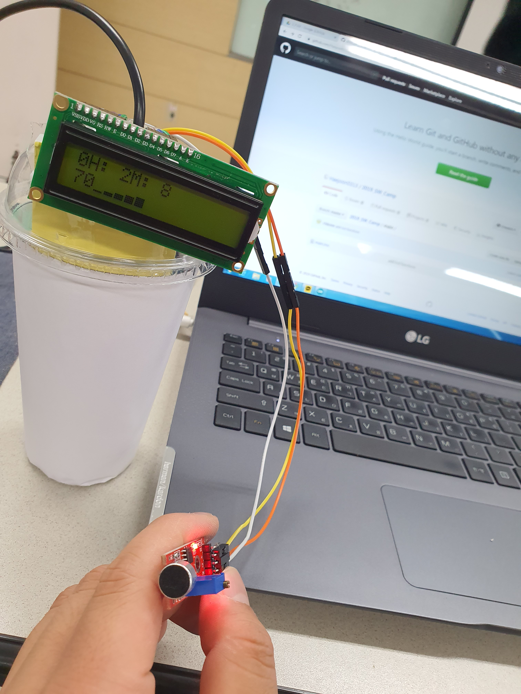
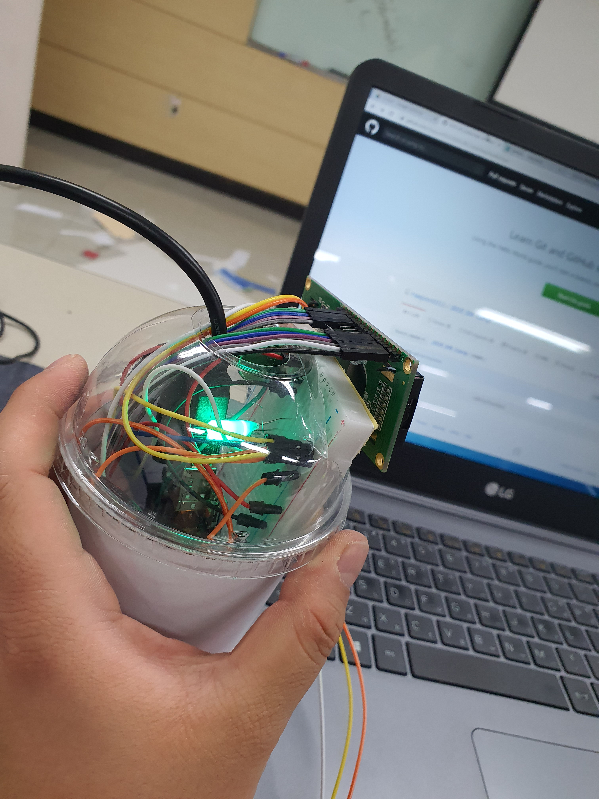

# IoT: 골지마(코골이\_수면무호흡증\_보조기)

## 프로젝트 설명

골지마는 코골이&무호흡증으로 고통받는 전우들을 돕는 보조기입니다!

## 프로젝트 구현사항

* 과도한 코골이 발생시 LED 적색 점등
* 코골이 정도에 따른 LED 색깔 표시
* 현재 코골이 수치 LCD 표시
* 현재 코골이 정도 LCD 표시
* 수면 종료(기기 OFF)시 수면 데이터(코골이_수치) 그래프화

## FutureWork

## 프로젝트 팀원

* 전유택 [https://github.com/r3dzone](https://github.com/r3dzone)
* 정해준 [https://github.com/Haejoon0313](https://github.com/Haejoon0313)

## 프로젝트 사진

